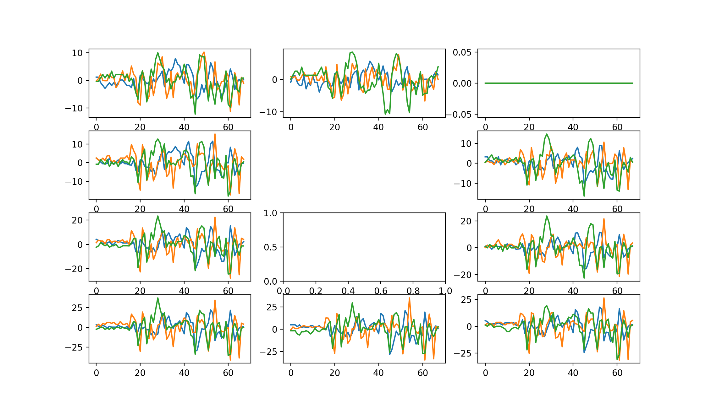

# MagWrist_Software

## About MagWrist
This is a project created by **QINGHAO LIU**.
The basic idea is that:

The program of the system has two parts: Hardware(Embedded Board) and Software(PC).

This README _Only_ talks about **Software** part.

## Overview

The software part is based on Python. If you are not familiar with it, please learn about it by yourself(REALLY EASY).

This repository contains many files, which are almost independent on each other.

- RealTimeShow.py  (Real-Time show the data of 10 magnetometers and 1 motion sensor as their physical postion)
- RealTimeShow_Relative.py (Choose a pivot. Show the relative value of each magnetometer to the pivot)
- Magnets_Permutation.py (Collect data when magnet is put on different area on your wrist)
- plot_data.py (Use the TXT file output by Magnets_Permutation.py and visualize the sensitive area for each finger)
- MultiFinger_Robust_Rotation.py (Collect Calibration&Single-Finger&Multi-Finger data)
- PCA_Display.py (Visualize the data on 2-D space after PCA)
- PCA_Display_Lib.py (The library of PCA_Display.py)

## Python Environment

No matter which OS(MacOS,Win,Unix,Linux) you are using, you are strongly recommended to run the program in **Terminal**.

1. Install Python3(There may be some problems with Python2, so please kindly use Python3). You can download it [here](https://www.python.org/downloads/). Confirm you have installed python3 successfully.
   - MacOS: Open **Terminal**. Type `python3`. If you can enter the shell, congratulations!
   - Win/Linux: Open **Terminal**. Type `python`. If you can enter the shell, congratulations!

2. Install Pip. Maybe the installation program above has installed pip for you. Confirm it:
   - MacOS: Open **Terminal**. Type `pip3 -V`. If the version number shows up, congratulations!
   - Win/Linux: Open **Terminal**. Type `pip -V`. If the version number shows up, congratulations!
   Otherwise, Google how to install pip for your PC.
3. Install packages needed by pip.

(For MacOS, replace `pip` with `pip3`)
```
pip install numpy
pip install matplotlib
pip install pyserial
pip install serial
pip install sklearn
```
## Find the serial port name of your device.

Open **Terminal**. Type the code as below(For MasOS, replace `python` with `python3`):
```
python -m serial.tools.list_ports
```
If no problem, you can see a list of serial port names of your PC.

Then, connect the embedded board to your PC by a microUSB-USB or microUSB-USB(Type-C) wire.

Execute the commmand above again. Please find out the new added port name.
- For MacOS: The port name format looks like this _/dev/cu.usbmodem0F00577F_
- For Win: The port name format looks like this _COM1_

## Recall the data format loaded from serial port
```
/* HMC5983 Part */
X_Axis_Data Y_Axis_Data Z_Axis_Data 0
X_Axis_Data Y_Axis_Data Z_Axis_Data 1
X_Axis_Data Y_Axis_Data Z_Axis_Data 2
X_Axis_Data Y_Axis_Data Z_Axis_Data 3
...
X_Axis_Data Y_Axis_Data Z_Axis_Data 9
/* MPU9250 Part */
Acc_X Acc_Y Acc_Z Gyr_X Gyr_Y Gyr_Z  0
```
That means you have to read 11 lines to get all sensors' data. 

For the first 10 lines, which are data of magnetometers, the number in the end of the line is the number of the magnetometer shown [here](https://raw.githubusercontent.com/lqh929289158/MagWrist_Hardware/master/Figures/MagArray.JPG).

For the last line, which is data of motion sensor, the number in the end of the line is just the number of I2C master. No need to cara about it.

## Start with RealTimeShow.py First!

This is a Real-time program that can plot the data of 10 magnetometers and 1 motion sensor vividly!

To run the program, please follow the steps below:

1. Modify port name. Open **RealTimeShow.py** with the editor you prefer. Find the code below:
```
ser = serial.Serial('/dev/cu.usbmodem0F00577F',1500000)
```
Replace the `/dev/cu.usbmodem0F00577F` with the port name of your device. For example:
```
ser = serial.Serial('COM3',1500000)
```
The second parameter `1500000` is clock frequency of UART. Please keep it the same with the hardware part. If you have no extra requirement, you do not need to change it.

2. Open **Teriminal** and locate to the repository. Execute the command below:

(For MacOS, replace `python` with `python3`)
```
python RealTimeShow.py
```

3. If you can see a dynamic figure like this, congratulations!(Please try moving or rotating the magnetometer array to observe the curve)


Explanation:
   - There are 11 windows, 10 around for magnetometers, 1 in middle for motion sensors.
   - In each magetometer window, there are 3 lines, **Blue for X-axis** data, **Orange for Y-axis** data, **Green for Z-axis** data.
   - In motion-sensor window, there would be 6 lines, 3 for accelermeter, 3 for gyroscope(Not shown on the picture).
   - The range of vertical axis will change automatically with the max and min value of the data so that you can watch it elegantly.
   - The range of horizontal axis will change periodically to subsitute new data for old data.
   
Possible problem:
   - All three lines of a magnetometer may keep constant(0/+-1024/+-2048)(See Right-Up side of the picture). Solution: **Check the connection between embedded board and magnetometer array**.
   - Some lines or data may be unstable and change dramatically. Solution: The same as above.
   - All lines become frozen suddenly. Solution: **Close the figure, re-connect embedded board, and try again**.
   - _**Only one of the line of a magnetometer keeps constant**_. That's the worst case. Probably your sensor chip has some problem. Unfortunately, there is no good solution until now but changing chip.
   
## Continue with RealTimeShow_Relative.py NEXT!

If you run this program, you can get a dynamic figure that will show you the relative value of 9 magnetometers to the other one(reference magnetometer), which means the substraction of each axis of each magenetomer to the corresponding axis of the reference magnetometer. We call the reference magnetometer **pivot**. 

To run the program, please follow the steps below:

1. Modify port name. Refer to [the title before](#start-with-realtimeshowpy-first)

2. Modify pivot number as you want. In the editor, search `pivot =` and you will get a line of code like `pivot = 3`. The number means which magnetometer you choose as a reference one. You can refer to the [image](https://raw.githubusercontent.com/lqh929289158/MagWrist_Hardware/master/Figures/MagArray.JPG) for the map of sensors.

3. Open **Teriminal** and locate to the repository. Execute the command below:

(For MacOS, replace `python` with `python3`)
```
python RealTimeShow_Relative.py
```

## Find the sensitive area of each finger.

This part we use two programs:

- **Magnets_Permutation.py**
- **plot_data.py**

### Magnets_Permutation.py (Data collection)

Please follow the instructions below:

1. Decide how to grid your wrist, in another word, how many rows, how many columns. e.g. row:4 col:9.
2. Decide how many vectors you want to sample for each finger(Must be a number that can be divided by 5). e.g. 10.
3. Open **Magnets_Permutation.py** and skip the function definition part and you will find three assignment.
```
batch = 5
row_num = 4
col_num = 9
```
The `batch` is how many vectors you want to sample for each finger. Modify it as you want but **_It must be a number that can be divided by 5_**.

Modify the `row_num` and the `col_num` too.

4. Modify port name. Refer to [the title before](#start-with-realtimeshowpy-first)

5. Choose one of your hand. e.g. left.  Direct the inner side of your wrist to your face. Draw the grid on you wrist as below.

 8  | 7 | 6 | 5 | 4 | 3 | 2 | 1 | 0 | .
--- | - | - | - | - | - | - | - | - | -
-- | -- | -- | -- | -- | -- | -- | -- | -- | 0
-- | -- | -- | -- | -- | -- | -- | -- | -- | 1
-- | -- | -- | -- | -- | -- | -- | -- | -- | 2
-- | -- | -- | -- | -- | -- | -- | -- | -- | 3

Yes! The column number is from right to left(Very strange but that\`s it).

6. Put a magnet on postion 00(row 0 col 0). And run the program as:

(For MacOS, replace `python` with `python3`)
```
python Magnets_Permutation.py lqh
```
Yes! There is a main argument. You can modify it as your name or whatever you want but you have to know that the argument you input will be a part of the name of the output file.

7. Follow the instructions in the program. The sequence of magnet position is 01, 02, 03,..., 08, 10, 11,..., 18,..., 38.
8. If you follow the instructions in the program correctly, then you will get a _txt_ file named like **finger_vectors_file_xxx.txt** in the folder.

### plot_data.py (Visualization)

Please follow the instructions below:

1. Modify the input file name(The file you got just now). Open **plot_data.py** and search `f = open`. You will find a line of code:
```
f = open('finger_vectors_file_yifeng.txt','r')
```
Change the first parameter to the file name you get `finger_vectors_file_xxx.txt`.

2. Modify the configuration of output figure.Search `fig = draw_power_for_each_finger` and you will find a line of code:
```
fig = draw_power_for_each_finger(single,interpol='bilinear',norm='off')
```
You can change the interpolation to None as this:
```
fig = draw_power_for_each_finger(single,interpol=None,norm='off')
```
Or you can use other interpolation as this:
```
fig = draw_power_for_each_finger(single,interpol='nearest',norm='off')
```

3. If you want to use **Normalization**(which means that the 5 subplot for 5 fingers will use the same color-bar range), modify the `norm` parameter to `'on'`. Then, search `norm_min = ` and you will find two assignment. Modify the Max and Min for the normalization.

4. Run the program.

(For MacOS, replace `python` with `python3`)
```
python plot_data.py
```

